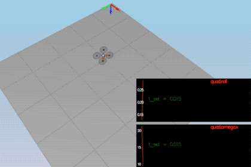
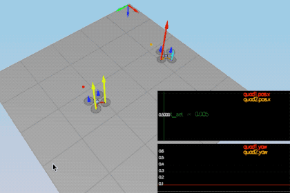
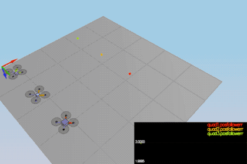
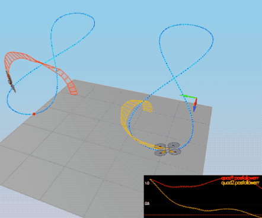

# FCND-Controls-CPP #
The C++ simulator and portion of the controls project \
\
Woodrow Wiest - Göteborg Sweden - May 2019 \
wwiest .at. gmail.com - [GitHub](https://github.com/woodrowwiest) 
\
\
\
Oh Great Project Reviewer,\
\
Thank you for taking the time to review my barebones-as-possible version of the Controls project for 
Udacity Flying Car Nanodegree. All scenarios are passing when simulated, but exact tweaking may still 
be interesting depending on one's desires for various flight characteristics. This project is 
barebones-as-possible simply due to timing for project submission. I have full intentions of revisiting 
every point and creating a smooth and beautiful flight controller as my skills improve, and lo how I 
intend them to!\
\
This project had a special type of challenge for me. I had to once again put aside my desire for perfection 
in order to be completed in time to move onto the next challenge. The mathematical theory of PID controllers, 
along with the witchcraftery required to tune the controller gains is definitely highly fascinating and 
overwhelming. I will definitely be studying this interesting field of control for robotics in more depth 
in the nearest future. Until then, my passing submission awaits your approval.
\
woodrow\
\
\
P.s. On a positive note, I've learned how to make drone butterflies! 
\


# The Process: #
This project is coded in C++.

- [The Code](#the-code)
  - [Generate Motor Commands](#generate-motor-commands)
  - [Body Rate Control](#implement-body-rate-control)
  - [Altitude Control](#implement-altitude-control)
  - [Lateral Position Control](#implement-lateral-position-control)
  - [Yaw Control](#implement-yaw-control)
- [Simulated Flight Tests](#simulated-flight-tests)


## The Code ##
#### Generate Motor Commands.  ####
Convert 3-axis moment and collective thrust commands to individual motor commands.
```
VehicleCommand QuadControl::GenerateMotorCommands(float collThrustCmd, V3F momentCmd){

  float l = L / sqrtf(2.f); 
  float c_bar = collThrustCmd; 
  float p_bar = momentCmd.x / l; 
  float q_bar = momentCmd.y / l;
  float r_bar = - momentCmd.z / kappa; 

  // each propeller thrust is one quarter of a whole
  float omega_1 = (c_bar + p_bar + q_bar + r_bar) * 0.25f;
  float omega_2 = (c_bar - p_bar + q_bar - r_bar) * 0.25f;
  float omega_3 = (c_bar + p_bar - q_bar - r_bar) * 0.25f;
  float omega_4 = (c_bar - p_bar - q_bar + r_bar) * 0.25f;

  cmd.desiredThrustsN[0] = (omega_1);
  cmd.desiredThrustsN[1] = (omega_2);
  cmd.desiredThrustsN[2] = (omega_3);
  cmd.desiredThrustsN[3] = (omega_4);

  return cmd;
}
```
#### Implement body rate control. ####
A proportional controller on body rates to commanded moments, taking into account moments of inertia.
```
V3F QuadControl::BodyRateControl(V3F pqrCmd, V3F pqr){

  V3F momentCmd;

  V3F I;
  I.x = Ixx;
  I.y = Iyy;
  I.z = Izz;
  momentCmd = I * kpPQR * (pqrCmd - pqr);

  return momentCmd;
}
```
#### Implement roll pitch control. ####
Using acceleration and thrust commands, in addition to the vehicle attitude, to output a body rate command.
```
V3F QuadControl::RollPitchControl(V3F accelCmd, Quaternion<float> attitude, float collThrustCmd){

 V3F pqrCmd;
 Mat3x3F R = attitude.RotationMatrix_IwrtB();

 if (collThrustCmd > 0) {

       // convert collThrustCmd from newtons to acceleration
       float accel = -collThrustCmd / mass;

       // grab rotation matrix
       float b_x = R(0, 2);
       float b_y = R(1, 2);

       //
       float b_x_c = accelCmd.x / accel;
       float b_y_c = accelCmd.y / accel;

       // prevent overshooting
       float b_x_c_constrained = CONSTRAIN(b_x_c, -maxTiltAngle, maxTiltAngle);
       float b_y_c_constrained = CONSTRAIN(b_y_c, -maxTiltAngle, maxTiltAngle);

       // find error (target - actual)
       float b_x_err = b_x_c_constrained - b_x;
       float b_y_err = b_y_c_constrained - b_y;

       // get p-term  (Kp * error)
       float b_x_p_term = kpBank * b_x_err;
       float b_y_p_term = kpBank * b_y_err;

       // rotation rate
       pqrCmd.x = (R(1,0) * b_x_p_term - R(0,0) * b_y_p_term) / R(2,2);
       pqrCmd.y = (R(1,1) * b_x_p_term - R(0,1) * b_y_p_term) / R(2,2);

   } else {
       pqrCmd.x = 0;
       pqrCmd.y = 0;
   }

   // do nothing with z here
   pqrCmd.z = 0;
    
  return pqrCmd;
}
```
#### Implement altitude control ####
Accounting for vehicle mass, using both down position and down velocity to command thrust.
```
float QuadControl::AltitudeControl(float posZCmd, float velZCmd, float posZ, float velZ, Quaternion<float> attitude, float accelZCmd, float dt){

  Mat3x3F R = attitude.RotationMatrix_IwrtB();
  float thrust = 0;

  // grab rotation matrix - how to utilize this?
  float b_z = R(2,2);

  // find error (target - actual)
  float z_err = posZCmd - posZ;
  float z_err_vel = velZCmd - velZ;

  // get p-term and d-term  (K * error)
  float p_term = z_err * kpPosZ;
  float d_term = z_err_vel * kpVelZ + velZ;

  // get i term
  integratedAltitudeError += z_err * dt;
  float i_term = integratedAltitudeError * KiPosZ;

  // calculate u_bar
  float u1_bar = p_term + d_term + i_term + accelZCmd;

  float accel = (u1_bar - CONST_GRAVITY) / b_z;

  // calculate thrust with constraints
  thrust = - mass * CONSTRAIN(accel, - maxAscentRate / dt, maxAscentRate / dt);
  
  return thrust;
}
```
#### Implement lateral position control ####
Using local North, East, position and velocity to generate commanded local acceleration.
```
V3F QuadControl::LateralPositionControl(V3F posCmd, V3F velCmd, V3F pos, V3F vel, V3F accelCmdFF){
  accelCmdFF.z = 0;
  velCmd.z = 0;
  posCmd.z = pos.z;
  
  V3F accelCmd = accelCmdFF;
  
  // x and y gains as single gain value to tune
  V3F kpPos;
  kpPos.x = kpPosXY;
  kpPos.y = kpPosXY;
  kpPos.z = 0.f;
    
  V3F kpVel;
  kpVel.x = kpVelXY;
  kpVel.y = kpVelXY;
  kpVel.z = 0.f;
    
  // limit max velocity and accelerations
  // mag() norm() are helpful here
  V3F capVelCmd;
    
  if (velCmd.mag() > maxSpeedXY) {
      capVelCmd = velCmd.norm() * maxSpeedXY;
  } else {
      capVelCmd = velCmd;
  }
    
  accelCmd = kpPos * (posCmd - pos) + kpVel * (capVelCmd - vel) + accelCmd;
    
  if (accelCmd.mag() > maxAccelXY) {
      accelCmd = accelCmd.norm() * maxAccelXY;
  }
  return accelCmd;
}
```
#### Implement yaw control ####
Linear proportional heading controller for yaw rates.
```
float QuadControl::YawControl(float yawCmd, float yaw) {
  float yawRateCmd=0;
  float err= yawCmd - yaw;
  
  if (err > F_PI) {
      err -= 2.f * F_PI;

  } if (err < -F_PI) {
      err += 2.f * F_PI;
  }
  yawRateCmd = kpYaw * err;
    
  return yawRateCmd;
}
```
## Simulated Flight Tests ##

### Performance Metrics ###

The specific performance metrics are as follows:

 #### Scenario 2 - Attitude Position ####
 Passing\
 
   - roll is less than 0.025 radian of nominal for 0.75 seconds (3/4 of the duration of the loop)
   - roll rate is less than 2.5 radian/sec for 0.75 seconds

 #### Scenario 3 - Position Control ####
 Passing\
 
   - X position of both drones are within 0.1 meters of the target for at least 1.25 seconds
   - Quad2 yaw is within 0.1 of the target for at least 1 second

 #### Scenario 4 - Nonidealities ####
 Passing\
 
   - position error for all 3 quads is less than 0.1 meters for at least 1.5 seconds

 #### Scenario 5 - Trajectory Follow ####
 Passing\
 
   - position error of the quad is less than 0.25 meters for at least 3 seconds

