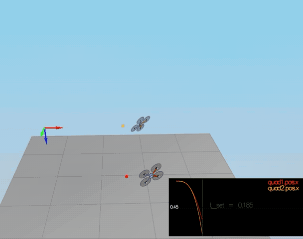

# FCND-Controls-CPP
The C++ simulator and portion of the controls project \
\
Woodrow Wiest - Göteborg Sweden - May 2019 \
wwiest .at. gmail.com - [GitHub](https://github.com/woodrowwiest) 
\
-
\
Oh Great Project Reviewer,\
\
Thank you for taking the time to review my barebones-as-possible version of the Controls
project for Udacity Flying Car Nanodegree. This project is barebones-as-possible only due to timing 
for project submission. I have full intentions of revisiting every point and creating a 
smooth and beautiful flight controller as my skills imporove, and oh how I intend them to!\
\
This project had a special type of challenge for me.  I had to once again put aside my desire for 
perfection in order to be completed in time to move onto the next challenge.  The mathematical theory 
of PID controllers, along with the witchcraftery required to tune the controller gains is definitely 
highly fascinating and overwhelming.  I will definitely be studying this interesting field of control 
for robotics in more depth in the nearest future.  Until then, my passing submission awaits your aproval.\
\
woodrow\
\
\
P.s. On a positive note, I've learned how to make drone butterflies! 
\

# The Process:
This project is coded in C++.\
*The Math*

*The Code*
#### Implement body rate control. ####

#### Implement roll pitch control. ####

#### Implement altitude control. ####

#### Implement lateral position control. ####

#### Implement yaw control. ####

## Simulated Flight Tests ##

### Performance Metrics ###

The specific performance metrics are as follows:

 - scenario 2
   - roll should less than 0.025 radian of nominal for 0.75 seconds (3/4 of the duration of the loop)
   - roll rate should less than 2.5 radian/sec for 0.75 seconds

 - scenario 3
   - X position of both drones should be within 0.1 meters of the target for at least 1.25 seconds
   - Quad2 yaw should be within 0.1 of the target for at least 1 second

 - scenario 4
   - position error for all 3 quads should be less than 0.1 meters for at least 1.5 seconds

 - scenario 5
   - position error of the quad should be less than 0.25 meters for at least 3 seconds

